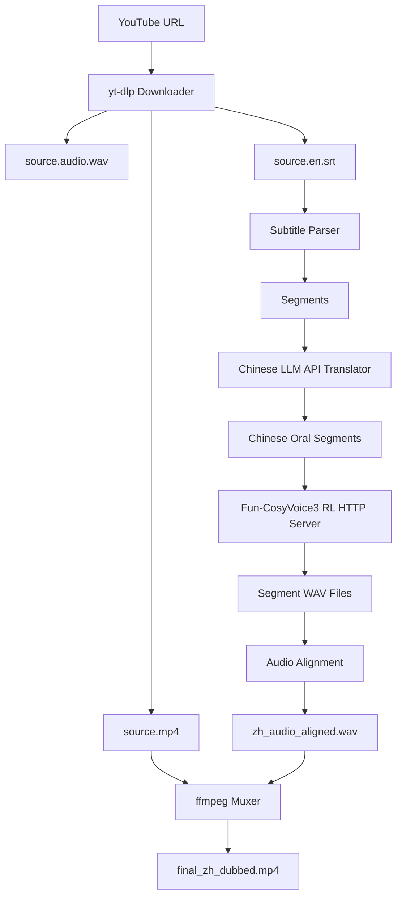

# VideoDubbingLab

VideoDubbingLab 是一个命令行视频翻译配音工程。当前默认推荐链路是：

```text
YouTube 字幕 -> 国产 OpenAI-compatible LLM 翻译 -> Fun-CosyVoice3-0.5B-2512_RL TTS -> 音频对齐 -> ffmpeg 合成
```

第一版仍保留 Edge TTS baseline，但生产实践建议使用本仓库内置的 Fun-CosyVoice3 RL HTTP 服务。

## 功能

- YouTube 单视频下载：视频、独立音频、字幕、元数据。
- SRT 字幕解析与中文字幕写出。
- OpenAI-compatible chat completions 翻译器，支持 Qwen、DeepSeek 等兼容 API。
- 推荐 TTS：`Fun-CosyVoice3-0.5B-2512_RL`，通过本地 HTTP 服务接入。
- 备用 TTS：Edge TTS、CosyVoice HTTP、GPT-SoVITS HTTP。
- 音频对齐：短音频补静音，略长音频加速，严重超长写入 warning。
- ffmpeg 合成中文配音视频。
- `manifest.json` 断点续跑。
- Docker / CUDA Docker 部署文件。
- pytest 基础测试。

## 架构图



## 3090 服务器推荐目录

```text
/opt/VideoDubbingLab                         # 主项目
/opt/tts/CosyVoice                           # CosyVoice 官方代码
/data/models/tts/Fun-CosyVoice3-0.5B-2512    # 模型权重，llm.pt 已替换为 RL 权重
```

不要把模型权重放进 Git 仓库。

## 安装主项目

```bash
cd /opt
git clone https://github.com/m1ngxiao/VideoDubbingLab.git
cd VideoDubbingLab

python -m venv .venv
source .venv/bin/activate
python -m pip install -U pip
python -m pip install -r requirements.txt
```

## 安装 ffmpeg 和 yt-dlp

Ubuntu：

```bash
sudo apt update
sudo apt install -y ffmpeg
python -m pip install -U yt-dlp
ffmpeg -version
yt-dlp --version
```

本项目的 `requirements.txt` 已包含 `yt-dlp`。

## 安装 Fun-CosyVoice3-0.5B-2512_RL

推荐在单独 conda 环境中部署 TTS 服务：

```bash
cd /opt/VideoDubbingLab
bash scripts/setup_cosyvoice3_rl_ubuntu.sh
```

脚本会做这些事：

- 安装系统依赖：`git-lfs`、`ffmpeg`、`sox` 等。
- clone 官方 `FunAudioLLM/CosyVoice` 到 `/opt/tts/CosyVoice`。
- 下载 `FunAudioLLM/Fun-CosyVoice3-0.5B-2512` 到 `/data/models/tts/Fun-CosyVoice3-0.5B-2512`。
- 把 `llm.rl.pt` 激活为运行时使用的 `llm.pt`，原始 `llm.pt` 会备份成 `llm.base.pt`。

如果想手动下载：

```bash
cd /opt/VideoDubbingLab
python -m pip install -r requirements-cosyvoice3.txt
python scripts/download_cosyvoice3_rl.py \
  --provider modelscope \
  --output-dir /data/models/tts/Fun-CosyVoice3-0.5B-2512
```

海外服务器可改用 Hugging Face：

```bash
python scripts/download_cosyvoice3_rl.py \
  --provider huggingface \
  --output-dir /data/models/tts/Fun-CosyVoice3-0.5B-2512
```

## 启动 Fun-CosyVoice3 RL HTTP 服务

```bash
cd /opt/VideoDubbingLab

# 如果你用了 conda 环境：
conda activate cosyvoice

export COSYVOICE_ROOT=/opt/tts/CosyVoice
export COSYVOICE_MODEL_DIR=/data/models/tts/Fun-CosyVoice3-0.5B-2512
export COSYVOICE_USE_RL=1
export COSYVOICE_PROMPT_TEXT="You are a helpful assistant.<|endofprompt|>希望你以后能够做的比我还好呦。"

bash scripts/run_cosyvoice3_rl_server.sh
```

服务默认监听：

```text
http://127.0.0.1:9880/tts
```

健康检查：

```bash
curl http://127.0.0.1:9880/health
```

直接测试 TTS：

```bash
curl -X POST http://127.0.0.1:9880/tts \
  -H "Content-Type: application/json" \
  -d '{"text":"你好，这是 Fun-CosyVoice3 RL 的中文配音测试。","sample_rate":24000}' \
  --output /tmp/cosyvoice3_test.wav
```

也可以用主项目 CLI 测试：

```bash
cd /opt/VideoDubbingLab
source .venv/bin/activate

python -m app.cli check-tts \
  --config ./configs/cosyvoice3_rl.yaml \
  --output ./data/output/tts_smoke_test.wav
```

## 配置国产大模型 API

项目从环境变量读取 API key，不会写入配置文件。

```bash
export LLM_API_KEY="your_api_key"
```

默认配置使用通义千问 DashScope compatible mode。DeepSeek 可参考 `configs/deepseek.yaml`。

## 检查环境

```bash
python -m app.cli check-env --config ./configs/cosyvoice3_rl.yaml
```

本命令会检查 Python、ffmpeg、ffprobe、yt-dlp、`LLM_API_KEY`、输出目录写权限和可选 CUDA 状态。

## 单视频运行

确保 TTS 服务已经在另一个终端运行，然后：

```bash
export LLM_API_KEY="your_key"

python -m app.cli dub-youtube \
  --url "https://www.youtube.com/watch?v=xxxx" \
  --output-dir ./data/output \
  --config ./configs/cosyvoice3_rl.yaml \
  --resume
```

如果 YouTube 没有字幕，第一版会直接报错：

```text
No subtitle found. Please provide subtitle file or enable ASR in future version.
```

## 批量运行

准备 `data/urls.txt`：

```text
https://www.youtube.com/watch?v=aaa
https://www.youtube.com/watch?v=bbb
```

执行：

```bash
python -m app.cli batch-youtube \
  --url-file ./data/urls.txt \
  --output-dir ./data/output \
  --config ./configs/cosyvoice3_rl.yaml
```

某个 URL 失败不会影响后续任务，最后会输出 summary。

## 本地视频和字幕

```bash
python -m app.cli dub-local \
  --video ./data/input/demo.mp4 \
  --subtitle ./data/input/demo.en.srt \
  --output-dir ./data/output/demo \
  --config ./configs/cosyvoice3_rl.yaml
```

## 输出文件说明

单个任务目录类似：

```text
data/output/{video_id}_{safe_title}/
├── source.mp4
├── source.video.*
├── source.audio.*
├── source.audio.wav
├── source.en.srt
├── source.info.json
├── zh.srt
├── zh_tts_segments/
├── zh_audio_aligned.wav
├── final_zh_dubbed.mp4
├── manifest.json
└── logs/run.log
```

关键结果：

- `final_zh_dubbed.mp4`：中文配音视频。
- `zh.srt`：中文字幕。
- `zh_audio_aligned.wav`：按原视频时间轴对齐后的中文总音频。
- `manifest.json`：断点续跑状态、warnings 和路径信息。

## 断点续跑

默认开启 `--resume`。已完成的 stage 会从 `manifest.json` 中跳过：

- `download`
- `parse_subtitle`
- `translate`
- `tts`
- `align_audio`
- `write_subtitle`
- `mux`

如果需要重新覆盖最终视频：

```bash
python -m app.cli dub-youtube --url "..." --force
```

## 切换 TTS Backend

推荐配置是：

```yaml
tts:
  backend: "cosyvoice_http"
  endpoint: "http://127.0.0.1:9880/tts"
  voice: "Fun-CosyVoice3-0.5B-2512_RL"
  sample_rate: 24000
  speaker: "default"
  ref_audio: null
  prompt_text: "You are a helpful assistant.<|endofprompt|>希望你以后能够做的比我还好呦。"
```

如需用自己的声音，准备 3 到 10 秒干净参考音频，并把 `ref_audio` 改为该音频路径，同时把 `prompt_text` 改为参考音频的准确文本。CosyVoice3 prompt 建议保留前缀：

```text
You are a helpful assistant.<|endofprompt|>
```

## Docker 部署

CPU baseline：

```bash
docker build -f docker/Dockerfile -t video-dubbing-lab .
docker run --rm -e LLM_API_KEY="$LLM_API_KEY" video-dubbing-lab
```

CUDA 环境：

```bash
docker compose -f docker/docker-compose.yml up --build
```

TTS 服务建议单独部署在宿主机或单独容器中，长期常驻 GPU，避免每个视频重复加载模型。

## 测试

```bash
pytest
```

## 常见问题

### 为什么不是直接在主进程里加载 CosyVoice3？

TTS 大模型加载慢、占显存。独立 HTTP 服务能常驻 GPU，主 pipeline 只负责下载、翻译、对齐和合成，稳定性更好。

### `llm.rl.pt` 怎么生效？

`scripts/download_cosyvoice3_rl.py` 和 `tts_servers/cosyvoice3_http_server.py` 都会把 `llm.rl.pt` 复制为 `llm.pt`，并把原始 `llm.pt` 备份为 `llm.base.pt`。

### 没有字幕怎么办？

第一版不做 ASR。请换有字幕的视频，或手动提供本地视频和 SRT 字幕使用 `dub-local`。

### Edge TTS 还能用吗？

可以。把配置里的 `tts.backend` 改回 `edge` 即可，但 3090 实践建议使用 Fun-CosyVoice3 RL。
