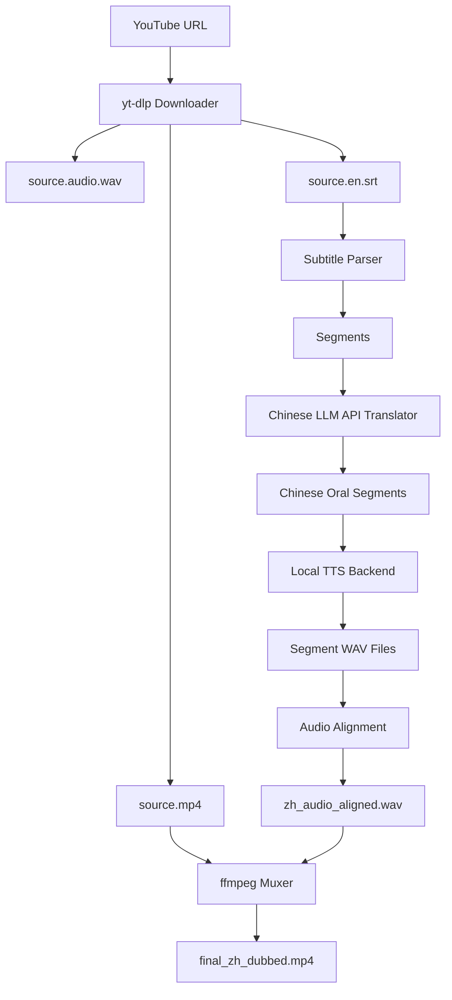

# VideoDubbingLab

VideoDubbingLab 是一个命令行视频翻译配音工程。第一版聚焦稳定跑通端到端链路：下载 YouTube 视频和字幕，调用 OpenAI-compatible 国产大模型把字幕翻译成中文口播稿，用 Edge TTS 或本地 HTTP TTS 服务生成中文语音，再按字幕时间轴对齐音频并用 ffmpeg 合成 `final_zh_dubbed.mp4`。

## 功能列表

- YouTube 单视频下载：视频、独立音频、字幕、元数据。
- SRT 字幕解析与中文字幕写出。
- OpenAI-compatible chat completions 翻译器，支持 Qwen、DeepSeek 等兼容 API。
- TTS 抽象层：内置 Edge TTS baseline，预留 CosyVoice HTTP 和 GPT-SoVITS HTTP backend。
- 音频对齐：短音频补静音，略长音频加速，严重超长写入 warning。
- ffmpeg 合成中文配音视频。
- `manifest.json` 断点续跑。
- Docker / CUDA Docker 部署文件。
- pytest 基础测试。

## 架构图



## 安装方式

服务器建议 Python 3.10+。

```bash
git clone <your-repo-url>
cd VideoDubbingLab
python -m venv .venv
source .venv/bin/activate
pip install -U pip
pip install -r requirements.txt
```

Windows 本地开发：

```powershell
python -m venv .venv
.\.venv\Scripts\Activate.ps1
python -m pip install -U pip
python -m pip install -r requirements.txt
```

## ffmpeg 安装

Ubuntu：

```bash
bash scripts/install_ffmpeg_ubuntu.sh
```

Windows 可以用 winget：

```powershell
winget install Gyan.FFmpeg
```

安装后确认：

```bash
ffmpeg -version
ffprobe -version
```

## yt-dlp 安装

`requirements.txt` 已包含 `yt-dlp`。如果需要单独升级：

```bash
pip install -U yt-dlp
yt-dlp --version
```

## 配置国产大模型 API

项目从环境变量读取 API key，不会写入配置文件。

```bash
export LLM_API_KEY="your_api_key"
```

PowerShell：

```powershell
$env:LLM_API_KEY="your_api_key"
```

默认配置使用通义千问 DashScope compatible mode：

```yaml
llm:
  provider: "openai_compatible"
  base_url: "https://dashscope.aliyuncs.com/compatible-mode/v1"
  api_key_env: "LLM_API_KEY"
  model: "qwen-plus"
```

DeepSeek 可参考 `configs/deepseek.yaml`：

```yaml
llm:
  provider: "openai_compatible"
  base_url: "https://api.deepseek.com/v1"
  api_key_env: "LLM_API_KEY"
  model: "deepseek-chat"
```

## 检查环境

```bash
python -m app.cli check-env --config ./configs/default.yaml
```

会检查 Python、ffmpeg、ffprobe、yt-dlp、`LLM_API_KEY`、输出目录写权限和可选 CUDA 状态。

## 单视频运行

```bash
export LLM_API_KEY="your_key"

python -m app.cli dub-youtube \
  --url "https://www.youtube.com/watch?v=xxxx" \
  --output-dir ./data/output \
  --config ./configs/default.yaml \
  --resume
```

如果 YouTube 没有字幕，第一版会直接报错：

```text
No subtitle found. Please provide subtitle file or enable ASR in future version.
```

## 批量运行

准备 `data/urls.txt`：

```text
https://www.youtube.com/watch?v=aaa
https://www.youtube.com/watch?v=bbb
```

执行：

```bash
python -m app.cli batch-youtube \
  --url-file ./data/urls.txt \
  --output-dir ./data/output \
  --config ./configs/default.yaml
```

某个 URL 失败不会影响后续任务，最后会输出 summary。

## 本地视频和字幕

```bash
python -m app.cli dub-local \
  --video ./data/input/demo.mp4 \
  --subtitle ./data/input/demo.en.srt \
  --output-dir ./data/output/demo \
  --config ./configs/default.yaml
```

## 输出文件说明

单个任务目录类似：

```text
data/output/{video_id}_{safe_title}/
├── source.mp4
├── source.video.*
├── source.audio.*
├── source.audio.wav
├── source.en.srt
├── source.info.json
├── zh.srt
├── zh_tts_segments/
├── zh_audio_aligned.wav
├── final_zh_dubbed.mp4
├── manifest.json
└── logs/run.log
```

关键结果：

- `final_zh_dubbed.mp4`：中文配音视频。
- `zh.srt`：中文字幕。
- `zh_audio_aligned.wav`：按原视频时间轴对齐后的中文总音频。
- `manifest.json`：断点续跑状态、warnings 和路径信息。

## 断点续跑

默认开启 `--resume`。已完成的 stage 会从 `manifest.json` 中跳过：

- `download`
- `parse_subtitle`
- `translate`
- `tts`
- `align_audio`
- `write_subtitle`
- `mux`

如果需要重新覆盖最终视频：

```bash
python -m app.cli dub-youtube --url "..." --force
```

## 切换 TTS Backend

默认使用 Edge TTS：

```yaml
tts:
  backend: "edge"
  voice: "zh-CN-XiaoxiaoNeural"
```

切换到 CosyVoice HTTP：

```yaml
tts:
  backend: "cosyvoice_http"
  endpoint: "http://127.0.0.1:9880/tts"
  speaker: "default"
  ref_audio: "./assets/ref.wav"
```

切换到 GPT-SoVITS HTTP：

```yaml
tts:
  backend: "gpt_sovits_http"
  endpoint: "http://127.0.0.1:9881/tts"
  ref_audio: "./assets/ref.wav"
  prompt_text: "这是一段参考音频的文本。"
  prompt_lang: "zh"
  text_lang: "zh"
```

## 接入 CosyVoice

建议把 CosyVoice 独立部署成常驻 GPU 服务，并提供 `/tts` HTTP 接口。VideoDubbingLab 会发送：

```json
{
  "text": "我们来看一下 CUDA 是怎么调度 warp 的。",
  "speaker": "default",
  "ref_audio": "./assets/ref.wav",
  "sample_rate": 24000
}
```

接口返回 `audio/wav` bytes。主程序会保存并转换到配置的采样率。

## 接入 GPT-SoVITS

GPT-SoVITS 同样建议独立服务化。VideoDubbingLab 会发送：

```json
{
  "text": "我们来看一下 CUDA 是怎么调度 warp 的。",
  "text_lang": "zh",
  "ref_audio_path": "./assets/ref.wav",
  "prompt_text": "这是一段参考音频的文本。",
  "prompt_lang": "zh"
}
```

接口返回 `audio/wav` bytes。

## Docker 部署

CPU baseline：

```bash
docker build -f docker/Dockerfile -t video-dubbing-lab .
docker run --rm -e LLM_API_KEY="$LLM_API_KEY" video-dubbing-lab
```

CUDA 环境：

```bash
docker compose -f docker/docker-compose.yml up --build
```

## 测试

```bash
pytest
```

## 常见问题

### 没有字幕怎么办？

第一版不做 ASR。请换有字幕的视频，或手动提供本地视频和 SRT 字幕使用 `dub-local`。

### LLM_API_KEY missing？

先导出环境变量，再运行命令。配置里的 `api_key_env` 只是环境变量名。

### Edge TTS 失败？

Edge TTS 依赖网络访问微软语音服务。服务器网络受限时，建议切换到本地 CosyVoice HTTP 或 GPT-SoVITS HTTP backend。

### 音频严重超长怎么办？

第一版不会强行压缩过长段落，会在 `manifest.json` 中写 warning。后续可通过缩短翻译口播稿、调快 TTS 语速或接入更可控的本地 TTS 服务改善。
